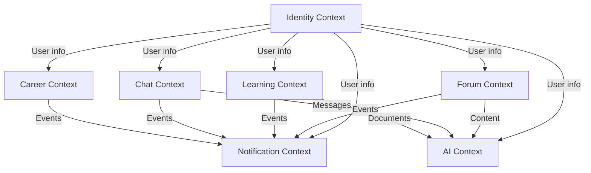

# 🎯 BOUNDED CONTEXTS

> **Xác định và định nghĩa các Bounded Contexts trong UniHub**
>
> Mỗi Bounded Context đại diện cho một domain model riêng biệt với ngôn ngữ và quy tắc riêng.

---

## 📋 OVERVIEW

UniHub được chia thành **7 Bounded Contexts** chính:

| #   | Context      | Type       | Team Size | Complexity |
| --- | ------------ | ---------- | --------- | ---------- |
| 1   | Identity     | Core       | 2 devs    | High       |
| 2   | Forum        | Core       | 3 devs    | High       |
| 3   | Learning     | Core       | 2 devs    | Medium     |
| 4   | Chat         | Core       | 2 devs    | High       |
| 5   | Career       | Supporting | 2 devs    | Medium     |
| 6   | Notification | Supporting | 1 dev     | Low        |
| 7   | AI           | Generic    | 1 dev     | Medium     |

---

## 🔐 1. IDENTITY CONTEXT

### 📝 Responsibilities

**Primary:**
- User registration and authentication
- Role-Based Access Control (RBAC)
- Permission management
- Official badge/verification system
- Session and token management

**Secondary:**
- User profile management
- Password reset workflow
- Email verification
- Two-factor authentication (future)

### 🔑 Core Concepts

**Ubiquitous Language:**
- **User**: Cá nhân có tài khoản trong hệ thống
- **Role**: Nhóm quyền hạn (Student, Teacher, Moderator, Admin, Recruiter)
- **Permission**: Quyền thực hiện hành động cụ thể (e.g., `Forum.Post.Delete`)
- **Official Badge**: Huy hiệu xác nhận đơn vị chính thức
- **Verified Account**: Tài khoản đã xác thực email @hcmue.edu.vn

### 🏗️ Aggregates

#### User Aggregate (Root)
```
User (Root)
├── UserId (GUID)
├── Email (Value Object)
├── PasswordHash
├── Profile
│   ├── FirstName
│   ├── LastName
│   ├── AvatarUrl
│   └── Bio
├── Roles (Collection)
├── OfficialBadge (Value Object - nullable)
├── VerifiedStatus
└── Metadata
    ├── CreatedAt
    ├── UpdatedAt
    └── LastLoginAt
```

**Invariants:**
- Email must be unique
- Password must meet strength requirements
- User can have multiple roles
- Official badge requires verification

#### Role Aggregate (Root)
```
Role (Root)
├── RoleId (GUID)
├── Name (e.g., "Student", "Teacher")
├── Description
├── Permissions (Collection)
└── IsSystemRole (bool)
```

**Invariants:**
- Role name must be unique
- System roles cannot be deleted
- At least one admin must exist

### 🔗 Dependencies

**Upstream:** None (Identity is foundational)

**Downstream:**
- All contexts consume user information
- Provides: `UserDto`, `PermissionDto`, `RoleSummaryDto`

### 📊 Database

**PostgreSQL Tables:**
- `Users`
- `Roles`
- `Permissions`
- `UserRoles` (many-to-many)
- `RolePermissions` (many-to-many)

### 🔄 Domain Events

- `UserRegisteredEvent`
- `UserProfileUpdatedEvent`
- `RoleAssignedEvent`
- `RoleRevokedEvent`
- `UserVerifiedEvent`
- `OfficialBadgeGrantedEvent`

---

## 📝 2. FORUM CONTEXT

### 📝 Responsibilities

**Primary:**
- Post creation and management (Questions, Discussions, Announcements)
- Comment system with nested replies
- Voting system (upvote/downvote)
- Category and tag management
- Content moderation

**Secondary:**
- Search and filtering
- Trending/Hot posts algorithm
- Confession (anonymous) posts
- Post bookmarks

### 🔑 Core Concepts

**Ubiquitous Language:**
- **Post**: Bài đăng chính (có title + content)
- **Thread**: Post + tất cả Comments tạo thành Thread
- **Comment**: Bình luận cho Post hoặc Comment khác (nested)
- **Vote**: Upvote (+1) hoặc Downvote (-1)
- **Category**: Danh mục phân loại (Học tập, Sinh hoạt, Nghề nghiệp, v.v.)
- **Tag**: Thẻ chi tiết hơn Category (#lập-trình, #thi-cuối-kỳ)
- **Confession**: Post ẩn danh

### 🏗️ Aggregates

#### Post Aggregate (Root)
```
Post (Root)
├── PostId (GUID)
├── Title
├── Content (Markdown)
├── Type (Question, Discussion, Announcement, Confession)
├── AuthorId (UserId - from Identity Context)
├── CategoryId
├── Tags (Collection of Tag Value Objects)
├── Comments (Collection - nested structure)
│   └── Comment
│       ├── CommentId
│       ├── Content
│       ├── AuthorId
│       ├── ParentCommentId (nullable)
│       ├── Votes (Collection)
│       └── CreatedAt
├── Votes (Collection)
│   └── Vote
│       ├── UserId
│       ├── VoteType (Up, Down)
│       └── CreatedAt
├── Status (Draft, Published, Archived, Deleted)
├── Metadata
│   ├── VoteCount (calculated)
│   ├── CommentCount (calculated)
│   ├── ViewCount
│   ├── CreatedAt
│   └── UpdatedAt
└── IsAnonymous (for Confessions)
```

**Invariants:**
- Post must have title and content
- Author cannot vote own post
- Confession posts hide author info
- Comments cannot exceed 5 levels nesting
- User can only vote once per post/comment

#### Category Aggregate (Root)
```
Category (Root)
├── CategoryId (GUID)
├── Name (e.g., "Học tập", "Sinh hoạt")
├── Slug (URL-friendly)
├── Description
├── Icon
├── Color
├── ParentCategoryId (nullable - for subcategories)
└── IsActive
```

**Invariants:**
- Category name must be unique
- Slug must be unique
- Cannot delete category with posts

### 🔗 Dependencies

**Upstream:**
- Identity Context → UserDto (for author info)

**Downstream:**
- Notification Context ← PostCreatedEvent, CommentAddedEvent
- AI Context ← PostContent (for moderation)

### 📊 Database

**PostgreSQL Tables:**
- `Posts`
- `Comments`
- `Votes`
- `Categories`
- `Tags`
- `PostTags` (many-to-many)

### 🔄 Domain Events

- `PostCreatedEvent`
- `PostPublishedEvent`
- `PostUpdatedEvent`
- `PostDeletedEvent`
- `CommentAddedEvent`
- `CommentDeletedEvent`
- `PostVotedEvent`
- `CommentVotedEvent`

---

## 📚 3. LEARNING CONTEXT

### 📝 Responsibilities

**Primary:**
- Document upload and storage
- Course/Subject management
- Faculty management
- Approval workflow (Pending → Approved/Rejected)
- Document search and filtering

**Secondary:**
- Document rating and reviews
- Download tracking
- Document versioning
- Related documents suggestion

### 🔑 Core Concepts

**Ubiquitous Language:**
- **Document**: File tài liệu (PDF, DOCX, slides)
- **Course**: Học phần (e.g., CS101 - Lập trình căn bản)
- **Faculty**: Khoa (e.g., Khoa Công nghệ Thông tin)
- **Approval**: Quy trình phê duyệt tài liệu
- **Moderator**: Người có quyền duyệt tài liệu
- **Semester**: Học kỳ (HK1, HK2, HK Hè)

### 🏗️ Aggregates

#### Document Aggregate (Root)
```
Document (Root)
├── DocumentId (GUID)
├── Title
├── Description
├── Type (LectureNotes, ExamPapers, Assignments, Slides)
├── CourseId
├── UploaderId (UserId)
├── FileMetadata
│   ├── FileUrl (cloud storage URL)
│   ├── FileName
│   ├── FileSize
│   ├── FileType (PDF, DOCX, etc.)
│   └── UploadedAt
├── ApprovalStatus (Pending, Approved, Rejected)
├── ApprovalMetadata
│   ├── ReviewerId (UserId - nullable)
│   ├── ReviewedAt (nullable)
│   └── RejectionReason (nullable)
├── Ratings (Collection)
│   └── Rating
│       ├── UserId
│       ├── Score (1-5)
│       ├── Review (optional)
│       └── CreatedAt
├── Statistics
│   ├── RatingAverage (calculated)
│   ├── RatingCount
│   ├── DownloadCount
│   └── ViewCount
└── Metadata
    ├── CreatedAt
    ├── UpdatedAt
    └── IsActive
```

**Invariants:**
- Document must belong to a valid course
- Pending documents are not public
- Only moderators can approve/reject
- Uploader cannot rate own document
- File size must not exceed limit (50MB)

#### Course Aggregate (Root)
```
Course (Root)
├── CourseId (GUID)
├── Code (e.g., "CS101")
├── Name (e.g., "Lập trình căn bản")
├── FacultyId
├── Credits
├── Semester (HK1, HK2, HK Hè)
├── Year (e.g., "2025-2026")
└── IsActive
```

**Invariants:**
- Course code must be unique per faculty
- Course must belong to a faculty

#### Faculty Aggregate (Root)
```
Faculty (Root)
├── FacultyId (GUID)
├── Name (e.g., "Khoa Công nghệ Thông tin")
├── ShortName (e.g., "CNTT")
├── Description
└── IsActive
```

**Invariants:**
- Faculty name must be unique

### 🔗 Dependencies

**Upstream:**
- Identity Context → UserDto (uploader, reviewer)

**Downstream:**
- Notification Context ← DocumentApprovedEvent, DocumentRejectedEvent

### 📊 Database

**PostgreSQL Tables:**
- `Documents`
- `Courses`
- `Faculties`
- `DocumentRatings`
- `DownloadHistory` (tracking)

### 🔄 Domain Events

- `DocumentSubmittedEvent`
- `DocumentApprovedEvent`
- `DocumentRejectedEvent`
- `DocumentRatedEvent`
- `DocumentDownloadedEvent`

---

## 💬 4. CHAT CONTEXT

### 📝 Responsibilities

**Primary:**
- Real-time messaging (1-to-1, group)
- Channel management (public chat rooms)
- Message delivery and read status
- File sharing in chat
- Online presence tracking

**Secondary:**
- Message search
- Message reactions/emojis
- Message threading
- Typing indicators

### 🔑 Core Concepts

**Ubiquitous Language:**
- **Conversation**: Cuộc trò chuyện (DM hoặc Group)
- **Message**: Tin nhắn trong conversation
- **Channel**: Phòng chat công khai (#general, #học-tập)
- **Group**: Nhóm chat riêng (3+ users)
- **Direct Message (DM)**: Chat 1-to-1

### 🏗️ Aggregates

#### Conversation Aggregate (Root)
```
Conversation (Root)
├── ConversationId (GUID)
├── Type (DirectMessage, Group, Channel)
├── Name (nullable - for groups/channels)
├── AvatarUrl (nullable - for groups/channels)
├── Participants (Collection of UserId)
├── Admins (Collection of UserId - for groups/channels)
├── Messages (Collection - stored separately in MongoDB)
├── LastMessage
│   ├── MessageId
│   ├── Preview (first 100 chars)
│   └── Timestamp
├── Metadata
│   ├── CreatedAt
│   ├── CreatedBy (UserId)
│   └── IsActive
└── IsPublic (for Channels)
```

**Invariants:**
- DM must have exactly 2 participants
- Group must have 3+ participants
- Channel can have unlimited participants
- User cannot send message to conversation they're not in

#### Message (Entity - stored in MongoDB)
```
Message
├── MessageId (GUID)
├── ConversationId
├── SenderId (UserId)
├── Content
│   ├── Text (nullable)
│   ├── Attachments (Collection)
│   │   └── Attachment
│   │       ├── FileUrl
│   │       ├── FileName
│   │       ├── FileType
│   │       └── FileSize
│   └── Type (Text, Image, File, System)
├── Status (Sent, Delivered, Read)
├── ReadBy (Collection of UserId with Timestamp)
├── ReplyTo (MessageId - nullable)
├── Reactions (Collection)
│   └── Reaction
│       ├── UserId
│       ├── Emoji
│       └── CreatedAt
├── CreatedAt
├── UpdatedAt (nullable)
└── DeletedAt (nullable - soft delete)
```

**Invariants:**
- Message must have content (text or attachment)
- Cannot edit system messages
- Cannot delete message after 24 hours (configurable)
- Deleted messages show "[Message deleted]"

#### Channel Aggregate (Root)
```
Channel (Root)
├── ChannelId (GUID)
├── Name (e.g., "#general", "#học-tập")
├── Description
├── Type (Public, Private)
├── Members (Collection of UserId)
├── Moderators (Collection of UserId)
└── CreatedAt
```

**Invariants:**
- Channel name must be unique
- Channel name must start with #

### 🔗 Dependencies

**Upstream:**
- Identity Context → UserDto (sender, participants)

**Downstream:**
- Notification Context ← MessageSentEvent

### 📊 Database

**MongoDB Collections:** (for high write throughput)
- `messages` (partitioned by conversation)
- `conversations` (metadata)

**PostgreSQL Tables:** (for relationships)
- `Channels`
- `ConversationParticipants`

**Redis:** (for real-time)
- Online presence
- Typing indicators
- Unread counts

### 🔄 Domain Events

- `MessageSentEvent`
- `MessageReadEvent`
- `MessageDeletedEvent`
- `ConversationCreatedEvent`
- `ParticipantAddedEvent`
- `ParticipantRemovedEvent`
- `UserOnlineEvent`
- `UserOfflineEvent`

### 🚀 Real-time Technology

- **SignalR** for WebSocket connections
- **Redis Backplane** for horizontal scaling

---

## 💼 5. CAREER CONTEXT

### 📝 Responsibilities

**Primary:**
- Job posting management
- Company profile management
- Application tracking
- Job search and filtering

**Secondary:**
- Resume/CV management
- Job matching algorithm
- Company verification
- Application status tracking

### 🔑 Core Concepts

**Ubiquitous Language:**
- **Job Posting**: Tin tuyển dụng
- **Company**: Công ty/Nhà tuyển dụng
- **Application**: Đơn ứng tuyển
- **Recruiter**: User đại diện công ty
- **Resume/CV**: Hồ sơ xin việc

### 🏗️ Aggregates

#### JobPosting Aggregate (Root)
```
JobPosting (Root)
├── JobPostingId (GUID)
├── CompanyId
├── Title (e.g., "Thực tập sinh Frontend")
├── Description (Markdown)
├── Requirements (Collection of strings)
├── Benefits (Collection of strings)
├── Location
│   ├── City
│   ├── District (optional)
│   └── Address (optional)
├── JobType (Fulltime, Parttime, Internship, Freelance)
├── Salary (Value Object - nullable)
│   ├── Min
│   ├── Max
│   ├── Currency (VND, USD)
│   └── Period (Monthly, Hourly)
├── Tags (Collection - e.g., "React", "Junior", "Remote")
├── Status (Draft, Published, Closed, Expired)
├── ExpiryDate
└── Metadata
    ├── PostedAt
    ├── UpdatedAt
    ├── ViewCount
    └── ApplicationCount
```

**Invariants:**
- Job posting must have title and description
- Expiry date must be in future
- Closed jobs cannot accept applications
- Company must be verified to post jobs

#### Company Aggregate (Root)
```
Company (Root)
├── CompanyId (GUID)
├── Name
├── Description
├── LogoUrl
├── Website
├── Industry (e.g., "Technology", "Education")
├── Size (Startup, Small, Medium, Large, Enterprise)
├── Location
│   ├── City
│   └── Address
├── ContactInfo
│   ├── Email
│   └── Phone
├── SocialLinks
│   ├── LinkedIn
│   ├── Facebook
│   └── Twitter
├── VerifiedStatus (Pending, Verified, Rejected)
├── Recruiters (Collection of UserId)
└── Metadata
    ├── CreatedAt
    └── UpdatedAt
```

**Invariants:**
- Company name must be unique
- Verified companies have priority in search
- At least one recruiter must be assigned

#### Application (Entity)
```
Application
├── ApplicationId (GUID)
├── JobPostingId
├── ApplicantId (UserId)
├── ResumeUrl
├── CoverLetter (optional)
├── Status (Pending, Reviewing, Accepted, Rejected, Withdrawn)
├── ReviewNotes (by recruiter - optional)
├── AppliedAt
└── UpdatedAt
```

**Invariants:**
- User can only apply once per job
- Cannot apply to closed/expired jobs
- Cannot withdraw after accepted/rejected

### 🔗 Dependencies

**Upstream:**
- Identity Context → UserDto (recruiter, applicant)

**Downstream:**
- Notification Context ← JobPostedEvent, ApplicationStatusChangedEvent

### 📊 Database

**PostgreSQL Tables:**
- `JobPostings`
- `Companies`
- `Applications`
- `CompanyRecruiters` (many-to-many)

### 🔄 Domain Events

- `JobPostedEvent`
- `JobUpdatedEvent`
- `JobClosedEvent`
- `ApplicationSubmittedEvent`
- `ApplicationStatusChangedEvent`
- `CompanyVerifiedEvent`

---

## 🔔 6. NOTIFICATION CONTEXT

### 📝 Responsibilities

**Primary:**
- In-app notifications
- Email notifications
- Push notifications (future)
- Notification preferences management

**Secondary:**
- Digest emails (daily/weekly)
- Subscription management
- Notification history

### 🔑 Core Concepts

**Ubiquitous Language:**
- **Notification**: Thông báo đến user
- **Subscription**: Đăng ký nhận thông báo
- **Digest**: Bản tin tổng hợp
- **Template**: Mẫu thông báo

### 🏗️ Aggregates

#### Notification Aggregate (Root)
```
Notification (Root)
├── NotificationId (GUID)
├── UserId
├── Type (PostComment, MessageReceived, JobPosted, DocumentApproved, etc.)
├── Title
├── Content
├── Data (JSON - additional metadata)
│   ├── EntityId (e.g., PostId, MessageId)
│   ├── EntityType
│   └── Link (URL to resource)
├── ReadStatus (Unread, Read)
├── ReadAt (nullable)
├── DeliveryChannels (InApp, Email, Push)
├── SentAt
└── ExpiresAt (optional)
```

**Invariants:**
- Notification must have at least one delivery channel
- Expired notifications are auto-archived

#### Subscription (Entity)
```
Subscription
├── SubscriptionId (GUID)
├── UserId
├── Type (PostComment, NewPost, JobPosted, etc.)
├── Target (optional - specific post, category, job tag)
├── Channels (InApp, Email, Push)
├── CreatedAt
└── IsActive
```

**Invariants:**
- User cannot have duplicate subscriptions

### 🔗 Dependencies

**Upstream:**
- All contexts → Domain Events

**Downstream:**
- Identity Context → UserDto (notification recipient)
- Email service (external)
- Push notification service (external)

### 📊 Database

**PostgreSQL Tables:**
- `Notifications`
- `Subscriptions`
- `NotificationTemplates`

**Redis:** (for real-time)
- Unread counts per user

### 🔄 Integration Events (Subscribed)

- `PostCreatedEvent` → Notify subscribers
- `CommentAddedEvent` → Notify post author
- `MessageSentEvent` → Notify recipient
- `JobPostedEvent` → Notify job seekers
- `DocumentApprovedEvent` → Notify uploader
- `ApplicationStatusChangedEvent` → Notify applicant

---

## 🤖 7. AI CONTEXT

### 📝 Responsibilities

**Primary:**
- AI chatbot conversations
- Content moderation (toxic content detection)
- Smart search with semantic understanding
- Content summarization

**Secondary:**
- AI provider management (Groq, Gemini rotation)
- Context-aware responses
- Related content suggestions
- Auto-tagging

### 🔑 Core Concepts

**Ubiquitous Language:**
- **AI Assistant**: Trợ lý AI
- **AI Chat Session**: Phiên trò chuyện với AI
- **Prompt**: Câu hỏi/lệnh từ user
- **AI Response**: Câu trả lời từ AI
- **Context**: Ngữ cảnh cho AI (documents, posts)

### 🏗️ Aggregates

#### AIConversation Aggregate (Root)
```
AIConversation (Root)
├── ConversationId (GUID)
├── UserId
├── ContextType (General, Document, Post, Job)
├── ContextId (nullable - specific resource)
├── Messages (Collection)
│   └── AIMessage
│       ├── MessageId
│       ├── Role (User, Assistant, System)
│       ├── Content
│       ├── Timestamp
│       └── TokensUsed
├── Metadata
│   ├── TotalTokensUsed
│   ├── CreatedAt
│   └── LastMessageAt
└── IsActive
```

**Invariants:**
- Conversation must have at least one message
- Cannot modify past messages
- Token usage is tracked per message

#### AIProvider (Value Object)
```
AIProvider
├── Name (Groq, Gemini, etc.)
├── ApiKey (encrypted)
├── Endpoint
├── Priority (1, 2, 3)
├── RateLimits
│   ├── RequestsPerMinute
│   └── TokensPerDay
├── IsActive
└── HealthStatus (Healthy, Degraded, Down)
```

### 🔗 Dependencies

**Upstream:**
- Forum Context → Posts, Comments (for moderation)
- Chat Context → Messages (for moderation)
- Learning Context → Documents (for search/summary)
- Identity Context → UserDto

**Downstream:**
- External AI APIs (Groq, Gemini)

### 📊 Database

**MongoDB Collections:** (for chat history)
- `ai_conversations`

**PostgreSQL Tables:** (for config)
- `AIProviders`
- `AIUsageStats`

**Redis:** (for caching)
- AI responses cache
- Rate limiting

### 🔄 Domain Events

- `AIConversationStartedEvent`
- `AIResponseGeneratedEvent`
- `ContentModeratedEvent` (toxic detected)

### 🚀 AI Features

**1. Chatbot:**
- Answer questions about courses, documents
- Help navigate the platform
- Provide study tips

**2. Content Moderation:**
- Detect toxic/spam posts
- Flag inappropriate content
- Suggest content removal

**3. Smart Search:**
- Semantic document search
- Related posts suggestion
- Job matching

**4. Summarization:**
- Summarize long posts/documents
- Generate TL;DR for threads
- Extract key points

---

## 📊 CONTEXT RELATIONSHIPS SUMMARY



**Key Insights:**

1. **Identity Context** is upstream to all (Shared Kernel)
2. **Notification Context** is downstream from all (Event subscriber)
3. **AI Context** consumes content from Forum, Chat, Learning
4. **Core Contexts** (Identity, Forum, Learning, Chat) are independent
5. **Supporting Contexts** (Career, Notification) depend on core

---

## 🔄 INTEGRATION PATTERNS

### 1. Shared Kernel: Identity

All contexts share `UserDto`, `PermissionDto` from Identity.

### 2. Published Language: Domain Events

Contexts communicate via domain events:
- **In-Process**: MediatR for same application
- **Out-of-Process**: Message bus (future: RabbitMQ/Azure Service Bus)

### 3. Customer/Supplier

- **Supplier**: Identity (provides user data)
- **Customers**: All other contexts

### 4. Conformist

- **AI Context** conforms to external AI APIs (Groq, Gemini)

---

## 📁 PROJECT STRUCTURE MAPPING

```
src/Modules/
├── Identity/
│   ├── UniHub.Modules.Identity.Domain/
│   ├── UniHub.Modules.Identity.Application/
│   ├── UniHub.Modules.Identity.Infrastructure/
│   └── UniHub.Modules.Identity.Presentation/
│
├── Forum/
│   ├── UniHub.Modules.Forum.Domain/
│   ├── UniHub.Modules.Forum.Application/
│   ├── UniHub.Modules.Forum.Infrastructure/
│   └── UniHub.Modules.Forum.Presentation/
│
├── Learning/
│   └── ... (same structure)
│
├── Chat/
│   └── ... (same structure)
│
├── Career/
│   └── ... (same structure)
│
├── Notification/
│   └── ... (same structure)
│
└── AI/
    └── ... (same structure)
```

---

## 🔐 CONTEXT ISOLATION RULES

### Hard Rules (MUST follow)

1. ✅ **No direct database access across contexts**
   - Each context has own tables/collections
   - Access via domain events or APIs

2. ✅ **No shared domain models**
   - Each context has own domain entities
   - Share only via DTOs

3. ✅ **No direct method calls across contexts**
   - Use MediatR commands/queries
   - Use domain events for side effects

### Soft Rules (SHOULD follow)

4. ⚠️ **Separate database schemas** (when possible)
   - `identity.*`
   - `forum.*`
   - `learning.*`
   - etc.

5. ⚠️ **Eventual consistency between contexts**
   - Use domain events for cross-context updates
   - Accept temporary inconsistency

---

## 📚 REFERENCES

- [Domain-Driven Design - Eric Evans](https://www.domainlanguage.com/)
- [Implementing DDD - Vaughn Vernon](https://vaughnvernon.com/)
- [GLOSSARY.md](./GLOSSARY.md)
- [CONTEXT_MAP.md](./CONTEXT_MAP.md)

---

## 🔄 VERSIONING

| Version | Date       | Changes                | Author |
| ------- | ---------- | ---------------------- | ------ |
| 1.0     | 2026-02-04 | Initial bounded contexts | Agent  |

---

_Last Updated: 2026-02-04_
