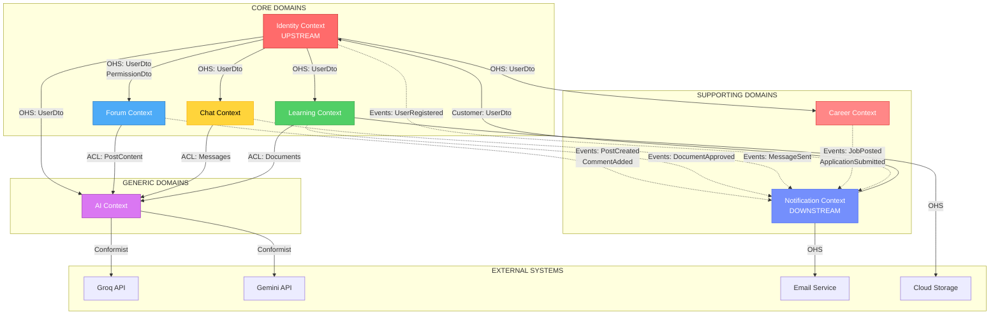

# 🗺️ CONTEXT MAP

> **Strategic mapping of relationships between Bounded Contexts in UniHub**
>
> Context Map giúp hiểu rõ cách các contexts tương tác, phụ thuộc lẫn nhau và integration patterns.

---

## 📋 OVERVIEW

Context Map là bản đồ chiến lược thể hiện:
- **Relationships**: Quan hệ giữa các bounded contexts
- **Integration Patterns**: DDD patterns được sử dụng
- **Direction**: Upstream (cung cấp) vs Downstream (tiêu thụ)
- **Dependencies**: Phụ thuộc và contracts

---

## 🗺️ VISUAL CONTEXT MAP



**Legend:**
- **Solid Arrow (→)**: Request-Response / Synchronous dependency
- **Dotted Arrow (-.→)**: Event-driven / Asynchronous communication
- **OHS**: Open Host Service
- **ACL**: Anti-Corruption Layer
- **Conformist**: Follows external API

---

## 🔄 CONTEXT RELATIONSHIPS DETAILED

### 1️⃣ IDENTITY CONTEXT (Upstream - Shared Kernel)

**Pattern**: **Open Host Service (OHS)**

**Position**: Upstream to ALL contexts

**Provides**:
```typescript
// Published Language
interface UserDto {
  id: string;
  email: string;
  displayName: string;
  firstName: string;
  lastName: string;
  avatarUrl?: string;
  officialBadge?: {
    name: string;
    icon: string;
  };
  roles: string[];
  isVerified: boolean;
}

interface UserSummaryDto {
  id: string;
  displayName: string;
  avatarUrl?: string;
}

interface PermissionDto {
  code: string; // e.g., "Forum.Post.Delete"
  name: string;
  module: string;
}
```

**Consumers**:
- Forum Context
- Learning Context
- Chat Context
- Career Context
- Notification Context
- AI Context

**Integration Method**:
- **In-Process**: Direct DTO sharing via `UniHub.Contracts`
- **REST API**: `/api/identity/users/{id}`
- **Events**: `UserRegisteredEvent`, `UserProfileUpdatedEvent`

**Why OHS?**:
- Identity is stable and core to all contexts
- Provides well-defined API that doesn't change frequently
- All contexts conform to Identity's model

---

### 2️⃣ FORUM CONTEXT

**Pattern**: **Customer/Supplier** with Identity (Customer)

**Position**: Core domain, publishes events downstream

#### Relationship: Forum → Identity

**Type**: **Customer/Supplier**
- **Forum** (Customer) depends on **Identity** (Supplier)
- Forum requests user info when displaying posts/comments

**Consumes**:
- `UserDto` for author information
- `PermissionDto` for authorization (who can delete/edit)

**Integration**:
```csharp
// Forum queries Identity
public class GetPostQueryHandler
{
    private readonly IIdentityService _identityService; // Anti-Corruption Layer
    
    public async Task<PostDto> Handle(GetPostQuery query)
    {
        var post = await _postRepository.GetByIdAsync(query.PostId);
        var author = await _identityService.GetUserAsync(post.AuthorId);
        
        return new PostDto
        {
            // ... post data
            Author = author, // UserDto from Identity
        };
    }
}
```

#### Relationship: Forum → Notification

**Type**: **Published Language** (Event-driven)
- Forum publishes domain events
- Notification subscribes and reacts

**Publishes**:
```csharp
// Domain Events
public record PostCreatedEvent(Guid PostId, Guid AuthorId, Guid CategoryId);
public record PostPublishedEvent(Guid PostId);
public record CommentAddedEvent(Guid PostId, Guid CommentId, Guid AuthorId, Guid? ParentCommentId);
public record PostVotedEvent(Guid PostId, Guid UserId, VoteType VoteType);
```

**Notification subscribes**:
```csharp
public class PostCreatedEventHandler : INotificationHandler<PostCreatedEvent>
{
    public async Task Handle(PostCreatedEvent @event)
    {
        // Notify subscribers of the category
        // Send notification to followers
    }
}
```

#### Relationship: Forum → AI

**Type**: **Anti-Corruption Layer (ACL)**
- Forum provides content for AI moderation
- Forum protects its domain model from AI Context

**Provides**:
```csharp
// Forum's ACL translates domain model to AI-friendly format
public interface IContentModerationService
{
    Task<ModerationResult> ModeratePostAsync(Guid postId);
}

// Implementation in Forum.Infrastructure
public class ContentModerationService : IContentModerationService
{
    private readonly IAIService _aiService;
    private readonly IPostRepository _postRepository;
    
    public async Task<ModerationResult> ModeratePostAsync(Guid postId)
    {
        var post = await _postRepository.GetByIdAsync(postId);
        
        // Translate to AI format (ACL)
        var content = new ContentToModerate
        {
            Text = post.Content,
            Type = "post"
        };
        
        return await _aiService.ModerateContentAsync(content);
    }
}
```

---

### 3️⃣ LEARNING CONTEXT

**Pattern**: **Customer/Supplier** with Identity (Customer)

**Position**: Core domain, publishes approval events

#### Relationship: Learning → Identity

**Type**: **Customer/Supplier**
- Learning depends on Identity for uploader and reviewer info

**Consumes**:
- `UserDto` for uploader, reviewer profiles
- `PermissionDto` for moderator checks

**Integration**:
```csharp
public class ApproveDocumentCommandHandler
{
    private readonly IIdentityService _identityService;
    private readonly IDocumentRepository _documentRepository;
    
    public async Task Handle(ApproveDocumentCommand command)
    {
        // Check if user is moderator
        var reviewer = await _identityService.GetUserAsync(command.ReviewerId);
        var hasPermission = reviewer.Permissions.Any(p => p.Code == "Learning.Document.Approve");
        
        if (!hasPermission)
            throw new UnauthorizedException();
        
        var document = await _documentRepository.GetByIdAsync(command.DocumentId);
        document.Approve(command.ReviewerId);
        
        // Publish event
    }
}
```

#### Relationship: Learning → Notification

**Type**: **Published Language** (Event-driven)

**Publishes**:
```csharp
public record DocumentSubmittedEvent(Guid DocumentId, Guid UploaderId, string Title);
public record DocumentApprovedEvent(Guid DocumentId, Guid UploaderId, Guid ApproverId);
public record DocumentRejectedEvent(Guid DocumentId, Guid UploaderId, string Reason);
```

#### Relationship: Learning → AI

**Type**: **Anti-Corruption Layer (ACL)**
- AI helps with document search, summarization
- Learning protects domain model

**Integration**:
```csharp
public interface IDocumentSearchService
{
    Task<IEnumerable<DocumentDto>> SearchSemanticAsync(string query);
}

// ACL translates Learning domain to AI format
public class DocumentSearchService : IDocumentSearchService
{
    private readonly IAIService _aiService;
    
    public async Task<IEnumerable<DocumentDto>> SearchSemanticAsync(string query)
    {
        // Use AI for semantic search
        var results = await _aiService.SearchDocumentsAsync(query);
        return results; // Already in DocumentDto format
    }
}
```

#### Relationship: Learning → Cloud Storage

**Type**: **Open Host Service**
- Learning uploads files to external cloud storage (Azure Blob, AWS S3, etc.)
- Cloud storage provides stable API

---

### 4️⃣ CHAT CONTEXT

**Pattern**: **Customer/Supplier** with Identity (Customer)

**Position**: Core domain, real-time focused

#### Relationship: Chat → Identity

**Type**: **Customer/Supplier**
- Chat needs user info for message senders, participants

**Consumes**:
- `UserSummaryDto` for participants (lighter than full UserDto)
- Online presence status

**Integration**:
```csharp
public class GetConversationQueryHandler
{
    private readonly IIdentityService _identityService;
    private readonly IConversationRepository _conversationRepository;
    
    public async Task<ConversationDto> Handle(GetConversationQuery query)
    {
        var conversation = await _conversationRepository.GetByIdAsync(query.ConversationId);
        
        // Fetch all participants in parallel
        var participantIds = conversation.Participants.ToList();
        var participants = await _identityService.GetUserSummariesAsync(participantIds);
        
        return new ConversationDto
        {
            // ... conversation data
            Participants = participants
        };
    }
}
```

#### Relationship: Chat → Notification

**Type**: **Published Language** (Event-driven)

**Publishes**:
```csharp
public record MessageSentEvent(Guid ConversationId, Guid SenderId, Guid MessageId, string Preview);
public record ConversationCreatedEvent(Guid ConversationId, List<Guid> ParticipantIds);
public record UserMentionedEvent(Guid ConversationId, Guid MessageId, Guid MentionedUserId);
```

#### Relationship: Chat → AI

**Type**: **Anti-Corruption Layer (ACL)**
- AI moderates chat messages for toxicity
- AI provides smart replies (future)

**Integration**:
```csharp
public class SendMessageCommandHandler
{
    private readonly IContentModerationService _moderationService;
    
    public async Task Handle(SendMessageCommand command)
    {
        // Check message content with AI
        var moderation = await _moderationService.ModerateTextAsync(command.Content);
        
        if (moderation.IsToxic)
            throw new InvalidOperationException("Message contains inappropriate content");
        
        // Create and send message
    }
}
```

---

### 5️⃣ CAREER CONTEXT

**Pattern**: **Customer/Supplier** with Identity (Customer)

**Position**: Supporting domain

#### Relationship: Career → Identity

**Type**: **Customer/Supplier**
- Career needs user profiles for applicants
- Career needs company/recruiter mapping

**Consumes**:
- `UserDto` for applicant profiles
- Company verification status (via Identity's official badge)

**Integration**:
```csharp
public class SubmitApplicationCommandHandler
{
    private readonly IIdentityService _identityService;
    private readonly IJobPostingRepository _jobPostingRepository;
    
    public async Task Handle(SubmitApplicationCommand command)
    {
        var applicant = await _identityService.GetUserAsync(command.ApplicantId);
        
        // Check if user has required role
        if (!applicant.Roles.Contains("Student") && !applicant.Roles.Contains("Alumni"))
            throw new UnauthorizedException("Only students and alumni can apply");
        
        // Create application
    }
}
```

#### Relationship: Career → Notification

**Type**: **Published Language** (Event-driven)

**Publishes**:
```csharp
public record JobPostedEvent(Guid JobId, Guid CompanyId, string Title, List<string> Tags);
public record ApplicationSubmittedEvent(Guid ApplicationId, Guid JobId, Guid ApplicantId);
public record ApplicationStatusChangedEvent(Guid ApplicationId, Guid ApplicantId, ApplicationStatus NewStatus);
```

---

### 6️⃣ NOTIFICATION CONTEXT (Downstream)

**Pattern**: **Published Language** subscriber

**Position**: Downstream from ALL contexts

**Role**: Listens to events and sends notifications

#### Relationship: All Contexts → Notification

**Type**: **Event-driven (Async)**
- Notification subscribes to events from all domains
- Decoupled via MediatR

**Subscribes To**:
```csharp
// Notification has handlers for ALL domain events
public class PostCreatedEventHandler : INotificationHandler<PostCreatedEvent>
{
    private readonly INotificationService _notificationService;
    
    public async Task Handle(PostCreatedEvent @event)
    {
        // Find subscribers interested in this category
        var subscribers = await GetCategorySubscribersAsync(@event.CategoryId);
        
        // Send notification
        await _notificationService.SendToUsersAsync(
            subscribers,
            "New Post",
            $"New post in category: {@event.Title}"
        );
    }
}

// Similar handlers for:
// - CommentAddedEventHandler
// - MessageSentEventHandler
// - DocumentApprovedEventHandler
// - JobPostedEventHandler
// etc.
```

#### Relationship: Notification → Identity

**Type**: **Customer/Supplier**
- Notification needs user contact info (email, push tokens)

**Consumes**:
- `UserDto` for email addresses
- User notification preferences

#### Relationship: Notification → Email Service

**Type**: **Open Host Service**
- External email provider (SendGrid, AWS SES, etc.)
- Notification conforms to their API

**Integration**:
```csharp
public class EmailNotificationChannel : INotificationChannel
{
    private readonly IEmailService _emailService; // External
    
    public async Task SendAsync(Notification notification)
    {
        await _emailService.SendEmailAsync(new Email
        {
            To = notification.UserEmail,
            Subject = notification.Title,
            Body = notification.Content
        });
    }
}
```

---

### 7️⃣ AI CONTEXT (Generic)

**Pattern**: **Conformist** to external APIs

**Position**: Generic domain, consumes content from core domains

#### Relationship: AI → External AI APIs

**Type**: **Conformist**
- AI Context conforms to Groq/Gemini APIs
- No translation layer, accepts their models

**Integration**:
```csharp
public class AIService : IAIService
{
    private readonly List<IAIProvider> _providers;
    
    public async Task<string> GenerateResponseAsync(string prompt)
    {
        // Try providers in priority order
        foreach (var provider in _providers.OrderBy(p => p.Priority))
        {
            try
            {
                return await provider.GenerateAsync(prompt);
            }
            catch (RateLimitException)
            {
                // Fallback to next provider
                continue;
            }
        }
        
        throw new Exception("All AI providers failed");
    }
}

// Groq Provider (Conformist - uses their SDK directly)
public class GroqProvider : IAIProvider
{
    private readonly GroqClient _client; // External SDK
    
    public async Task<string> GenerateAsync(string prompt)
    {
        // Directly use Groq's API structure
        var response = await _client.Chat.CreateAsync(new GroqChatRequest
        {
            Model = "llama-3.1-70b-versatile",
            Messages = new[] { new Message { Role = "user", Content = prompt } }
        });
        
        return response.Choices[0].Message.Content;
    }
}
```

#### Relationship: Forum/Chat/Learning → AI

**Type**: **Anti-Corruption Layer (ACL)**
- AI consumes content but core domains protect themselves
- Core domains define interfaces, AI implements

**Integration Pattern**:
```csharp
// Defined in Forum.Application (core owns interface)
public interface IContentModerationService
{
    Task<ModerationResult> ModerateAsync(string content);
}

// Implemented in AI.Infrastructure (AI conforms)
public class AIContentModerationService : IContentModerationService
{
    private readonly IAIService _aiService;
    
    public async Task<ModerationResult> ModerateAsync(string content)
    {
        var prompt = $"Analyze this content for toxicity: {content}";
        var response = await _aiService.GenerateResponseAsync(prompt);
        
        // Parse AI response and return in Forum's expected format
        return new ModerationResult
        {
            IsToxic = response.Contains("toxic"),
            Confidence = 0.95
        };
    }
}
```

---

## 📊 INTEGRATION PATTERNS SUMMARY

### Pattern Classification

| Pattern                    | Contexts                      | Description                                      |
| -------------------------- | ----------------------------- | ------------------------------------------------ |
| **Open Host Service**      | Identity → All                | Stable, well-defined API that all can use        |
| **Published Language**     | All → Notification (events)   | Asynchronous event-driven communication          |
| **Customer/Supplier**      | Most relationships            | Clear customer (depends) and supplier (provides) |
| **Anti-Corruption Layer**  | Core → AI                     | Protect core domain from external changes        |
| **Conformist**             | AI → External APIs            | Accept external API without translation          |
| **Shared Kernel**          | Identity (partially)          | UserDto, PermissionDto shared across all         |

---

## 🔀 COMMUNICATION MECHANISMS

### 1. Synchronous (Request-Response)

**When**: Need immediate data

**How**: 
- In-process: Direct service calls via interfaces
- Out-of-process: REST API calls

**Example**:
```csharp
// Forum needs user info NOW to display post
var user = await _identityService.GetUserAsync(authorId); // Synchronous
```

**Used By**:
- Forum → Identity (get user)
- Learning → Identity (check permissions)
- Chat → Identity (get participants)
- Career → Identity (get applicant)

---

### 2. Asynchronous (Event-Driven)

**When**: Side effects, don't need immediate response

**How**:
- In-process: MediatR domain events
- Out-of-process (future): Message bus (RabbitMQ, Azure Service Bus)

**Example**:
```csharp
// Forum publishes event, doesn't wait for notification
await _mediator.Publish(new PostCreatedEvent(postId, authorId, categoryId));
// Forum continues, notification handles separately
```

**Used By**:
- All → Notification (notifications)
- Identity → All (user changes)

---

### 3. Database-Level Integration (AVOID)

**When**: **NEVER** ❌

**Why**: 
- Breaks bounded context isolation
- Tight coupling
- Hard to change

**Instead**:
- Use events or APIs
- Each context owns its data

---

## 🏗️ ARCHITECTURAL DECISIONS

### Decision 1: Identity as Shared Kernel

**Rationale**:
- All contexts need user information
- Identity is stable and well-defined
- Avoids duplication across contexts

**Trade-off**:
- Tight coupling to Identity
- Identity changes affect all

**Mitigation**:
- Keep Identity API stable
- Use versioning if breaking changes needed

---

### Decision 2: Event-Driven for Notification

**Rationale**:
- Notification is pure side effect
- Don't want to slow down core operations
- Easy to add new notification types

**Trade-off**:
- Eventual consistency
- Harder to debug

**Mitigation**:
- Event sourcing for audit trail
- Retry mechanisms

---

### Decision 3: ACL for AI Integration

**Rationale**:
- External AI APIs are unstable
- Protect core domains from AI changes
- Can swap AI providers

**Trade-off**:
- Extra translation layer
- Some performance overhead

**Mitigation**:
- Caching of AI responses
- Async where possible

---

## 🔄 CONTEXT EVOLUTION STRATEGY

### Phase 1: Modular Monolith (Current)

**Integration**: In-process (same application)
- MediatR for events
- Direct service interfaces
- Shared database (different schemas)

```
┌─────────────────────────────────────┐
│        UniHub.API (Monolith)        │
├─────────────────────────────────────┤
│  ┌─────────┐  ┌─────────┐  ┌────┐  │
│  │ Identity│  │  Forum  │  │ AI │  │
│  └────┬────┘  └────┬────┘  └─┬──┘  │
│       │            │          │     │
│       └────────┬───┴──────────┘     │
│                │ MediatR Events     │
└────────────────┼────────────────────┘
                 │
            PostgreSQL
```

---

### Phase 2: Microservices (Future - If Needed)

**Integration**: Out-of-process
- Message bus (RabbitMQ, Azure Service Bus)
- REST APIs
- Separate databases

```
┌────────────┐     ┌────────────┐     ┌────────────┐
│  Identity  │     │   Forum    │     │    Chat    │
│  Service   │     │  Service   │     │  Service   │
└─────┬──────┘     └─────┬──────┘     └─────┬──────┘
      │                  │                   │
      └──────────┬───────┴──────────────────┘
                 │
         ┌───────┴───────┐
         │  Message Bus  │
         │  (RabbitMQ)   │
         └───────────────┘
```

**When to migrate**:
- Performance issues (bottlenecks)
- Scaling needs (different contexts need different resources)
- Team size grows (multiple teams)

**Current decision**: Stay monolith until proven need

---

## 📚 REFERENCES

- [Domain-Driven Design - Eric Evans](https://www.domainlanguage.com/)
- [Context Mapping - Vaughn Vernon](https://vaughnvernon.com/)
- [Strategic DDD - Alberto Brandolini](https://www.eventstorming.com/)
- [GLOSSARY.md](./GLOSSARY.md)
- [BOUNDED_CONTEXTS.md](./BOUNDED_CONTEXTS.md)

---

## 🔄 VERSIONING

| Version | Date       | Changes           | Author |
| ------- | ---------- | ----------------- | ------ |
| 1.0     | 2026-02-04 | Initial context map | Agent  |

---

_Last Updated: 2026-02-04_
